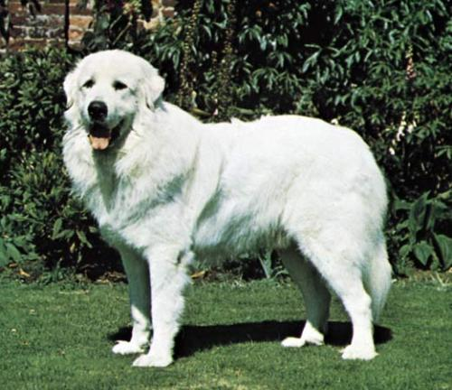

# Dog-Breed-Classifier

## Project Description:

A dog show pageant is looking for a way to automatically classify animals entering into the competition. They are looking to use a computer vision model to make the process easier. The model should look to classify whether an animal is a dog, as well as the breed of the dog. 

<p align="center">
  
</p>

The model within this project uses a pretrained model. There are three models to choose from - AlexNet, ResNet and VGG. Each model will be tested on the images presented in the pet_images folder. A report of the performance of each will be presented, and the final model will be selected based on the results. 
 
## Installations: 
The following packages are needed to run the project: 
- ast
- PIL
- Torchvision
- PyTorch
- Argparse

## How to Interact with this Project:
In order to run this project, run the following command: 
```
sh run_models_batch.sh
```

In order to run an inference on your own images, upload the JPEG files (preferably, with equal dimensions in height and width). Once uploaded, run the following Bash script: 
```
sh run_models_batch_uploaded.sh
```
```